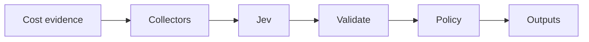

# JEV Cloud Cost Guardian

[](https://github.com/JevForge/jev-cloud-cost-guardian/releases)
[](LICENSE)
[](https://github.com/JevForge/jev-cloud-cost-guardian/actions/workflows/ci.yml)

**Evaluate proposed cloud spend against a budget** and expose a typed CI gate (`approve`, `warn`, `block`, or `manual-review`) using [TypeSafe Jev](https://vercel.com/ai-gateway/models/jev).

Infrastructure PRs often ship without a clear cost signal. This Action collects plan/billing evidence, asks Jev for a structured decision, then applies deterministic rails so every cost line stays visible. It does **not** apply Terraform, kubectl, or cloud mutations.

```yaml
- id: cost
  uses: JevForge/jev-cloud-cost-guardian@v0.1.0
  env:
    AI_GATEWAY_API_KEY: ${{ secrets.AI_GATEWAY_API_KEY }}
  with:
    budget_monthly: '1000'
    estimates_path: examples/estimates.yml
```

## Features

* Typed FinOps gate powered by Jev (`experimental_evaluate`, not free-form generation)
* Secret-based authentication (`AI_GATEWAY_API_KEY`, `TYPESAFE_API_KEY`, or `JEV_CUSTOM_API_KEY`)
* Structured outputs for later steps (`decision`, `utilization`, `findings`, …)
* Collectors for normalized estimates, Infracost, Terraform plans, Kubernetes, Kubecost, AWS, Azure, and GCP
* Deterministic policy that can tighten `approve`/`warn` but never loosens `block`/`manual-review`
* Cost lines are never dropped; unpriced resources stay visible
* Optional pull request comment with job summary (idempotent)
* Optional Check Run and managed `jev:cost:*` labels for PR status
* Configurable low-confidence policy: `fail` | `warn` | `request-review` | `no-op`

## How it works

```text
Cost evidence (plan / bill / estimates)
        ↓
Normalize + convert currency + redact
        ↓
Jev typed evaluation
        ↓
Schema validation + deterministic policy
        ↓
Action outputs (+ optional PR comment)
        ↓
Next CI/CD step (branch on decision)
```



1. Collect cost lines from files and/or cloud connectors.
2. Normalize to one monthly budget currency (missing FX rates fail closed).
3. Call Jev through `jev_provider` (no silent provider fallback).
4. Validate the typed answer; out-of-contract choices fail the Action.
5. Apply rails for confidence, unpriced/partial lines, missing baseline, and block ceiling.
6. Emit outputs and an optional PR comment. Fail when `decision=block` and `fail_on_block=true`.

## Demo

```text
Pull Request: add aws_instance.web (+$42.50/mo)
        ↓
Baseline $800 + delta $42.50 → projected $842.50
Budget $1000 → utilization 84.3%
        ↓
Jev → decision = warn
      confidence = 0.82
      reason_codes includes APPROACHING_BUDGET
        ↓
Workflow continues with a warning (or fails if you choose)
```

## Quick Start

1. Add repository secret `AI_GATEWAY_API_KEY` (default Jev provider).
2. Provide at least one cost source (for example [`examples/estimates.yml`](examples/estimates.yml)).
3. Add a workflow:

```yaml
name: Cloud cost gate
on:
  pull_request:

permissions:
  contents: read

jobs:
  cost:
    runs-on: ubuntu-latest
    steps:
      - uses: actions/checkout@v4

      - id: cost
        uses: JevForge/jev-cloud-cost-guardian@v0.1.0
        env:
          AI_GATEWAY_API_KEY: ${{ secrets.AI_GATEWAY_API_KEY }}
        with:
          budget_monthly: '1000'
          estimates_path: examples/estimates.yml

      - name: Print decision
        run: |
          echo "decision=${{ steps.cost.outputs.decision }}"
          echo "utilization=${{ steps.cost.outputs.utilization }}"
          echo "summary=${{ steps.cost.outputs.summary }}"
```

Pin `@v0.1.0`, the floating major `@v0`, or a full commit SHA.

Defaults can also live in `.jev/config.yml`. A workflow input wins when it is set.

Optional `budgets[]` rules override the global `budget_monthly` when they match (most specific wins: environment + path + service):

```yaml
budget_monthly: 1000
budgets:
  - name: production
    environment: production
    monthly: 1000
  - name: api-module
    environment: production
    path: module.api.*
    monthly: 400
```

## Complete Example

Infracost + PR comment + branch on decision:

```yaml
name: Cloud cost gate
on:
  pull_request:

permissions:
  contents: read
  pull-requests: write

jobs:
  cost:
    runs-on: ubuntu-latest
    steps:
      - uses: actions/checkout@v4

      - name: Infracost breakdown
        run: infracost breakdown --path . --format json --out-file infracost.json
        env:
          INFRACOST_API_KEY: ${{ secrets.INFRACOST_API_KEY }}

      - id: cost
        uses: JevForge/jev-cloud-cost-guardian@v0.1.0
        env:
          AI_GATEWAY_API_KEY: ${{ secrets.AI_GATEWAY_API_KEY }}
        with:
          budget_monthly: '1000'
          currency: USD
          environment: production
          infracost_path: infracost.json
          comment_on_github: 'true'
          fail_on_block: 'true'
          github_token: ${{ github.token }}

      - name: Continue only when approved or warned
        if: steps.cost.outputs.decision == 'approve' || steps.cost.outputs.decision == 'warn'
        run: echo "Cost gate passed with ${{ steps.cost.outputs.decision }}"

      - name: Stop risky deploys
        if: steps.cost.outputs.decision == 'block'
        run: |
          echo "Blocked by cost gate"
          exit 1
```

More samples: [`examples/basic.yml`](examples/basic.yml), [`examples/pr-gate.yml`](examples/pr-gate.yml), [`examples/workflow.yml`](examples/workflow.yml).

## Inputs

| Input | Required | Default | Description |
| ----- | -------- | ------- | ----------- |
| `budget_monthly` | yes\* | | Monthly budget (\*or set in `.jev/config.yml`) |
| `baseline_path` | no | | Explicit baseline file (`baseline_monthly` or baseline lines) |
| `require_baseline` | no | `false` | Fail when projected scope has no baseline |
| `currency` | no | `USD` | Budget currency |
| `environment` | no | `production` | `production` / `staging` / `development` / `sandbox` / `other` |
| `budget_scope` | no | `projected` | `projected` or `delta` |
| `window_start` / `window_end` | no | current UTC month | End is exclusive |
| `warn_utilization` | no | `0.8` | Approaching-budget label |
| `block_utilization` | no | `1` | Ceiling that can force `block` |
| `estimates_path` | no† | | Normalized estimates file |
| `estimates_json` | no† | | Inline estimates JSON (not with `estimates_path`) |
| `infracost_path` | no† | | Infracost JSON |
| `terraform_plan_path` | no† | | `terraform show -json` |
| `pricing_catalog_path` | no | | Prices for Terraform addresses |
| `kubernetes_paths` | no† | | Manifest files or directories |
| `k8s_unit_prices_path` | with k8s | | CPU/memory unit prices |
| `kubecost_path` | no† | | Kubecost allocation JSON |
| `aws_enabled` | no† | `false` | AWS Cost Explorer |
| `include_aws_forecast` | no | `false` | Informational forecast line |
| `azure_enabled` | no† | `false` | Azure Cost Management |
| `azure_subscription_id` | with Azure | env | Subscription id |
| `gcp_enabled` | no† | `false` | BigQuery billing export |
| `gcp_project_id` / `gcp_billing_dataset` / `gcp_billing_table` | with GCP | env | Query target |
| `gcp_location` | no | `US` | BigQuery location |
| `normalize_to_monthly` | no | `false` | Scale non-calendar-month windows |
| `fx_rates` | no | | JSON FX map, e.g. `{"EUR":1.08}` |
| `min_confidence` | no | `0.75` | Minimum confidence for `approve` |
| `low_confidence_policy` | no | `fail` | `fail` / `warn` / `request-review` / `no-op` |
| `enforce_block_threshold` | no | `true` | Apply block ceiling |
| `allow_unpriced` | no | `false` | Allow `approve` with unpriced lines |
| `allow_partial` | no | `false` | Allow `approve` with partial lines |
| `allow_missing_baseline` | no | `false` | Allow projected `approve` without baseline |
| `fail_on_block` | no | `true` | Fail workflow on `block` |
| `fail_on_manual_review` | no | `false` | Fail workflow on `manual-review` |
| `redact_resource_names` | no | `true` | Hash addresses before Jev/outputs |
| `jev_provider` | no | `vercel-ai-gateway` | How to reach Jev |
| `jev_endpoint` | native/custom | | HTTPS evaluate URL |
| `jev_model` | native/custom | gateway default | Pinned Jev model id |
| `timeout_ms` | no | `45000` | Jev timeout |
| `connector_timeout_ms` | no | `20000` | Cloud API timeout |
| `comment_on_github` | no | `false` | Create/update one PR comment |
| `dry_run` | no | `false` | Skip the comment |
| `github_token` | with comments | `github.token` | Comment token |

† At least one cost source is required (file path, inline JSON, or enabled billing connector).

Connector details: [docs/connectors.md](docs/connectors.md).

## Outputs

| Output | Description |
| ------ | ----------- |
| `decision` | `approve`, `warn`, `block`, or `manual-review` |
| `confidence` | 0–1 |
| `reason_codes` | JSON array of stable codes |
| `estimated_monthly_impact` | Proposed monthly delta |
| `baseline_monthly` | Known baseline, or empty |
| `projected_monthly` | Baseline + delta, or empty |
| `budget_monthly` | Budget used |
| `budget_rule` | Matched `budgets[]` rule name, or empty |
| `budget_remaining` | Budget − scoped cost (negative = over) |
| `utilization` | Scoped cost ÷ budget |
| `currency` | Budget currency |
| `summary` | One-line summary |
| `explanation` | Display-only explanation |
| `provisional` | `true` when Jev did not return a usable answer |
| `findings` | JSON array of every cost line |
| `sources` | JSON array of source ids |
| `unpriced_count` | Lines without a monthly cost |

### Using outputs in conditions

```yaml
- name: Deploy staging
  if: steps.cost.outputs.decision == 'approve'
  run: ./deploy.sh

- name: Require FinOps review
  if: steps.cost.outputs.decision == 'manual-review'
  run: echo "Send to FinOps"
```

## Authentication

Jev credentials come from environment secrets—not Action inputs.

```text
Repository → Settings → Secrets and variables → Actions → New repository secret
```

| Provider (`jev_provider`) | Secret |
| ------------------------- | ------ |
| `vercel-ai-gateway` (default) | `AI_GATEWAY_API_KEY` |
| `typesafe-native` | `TYPESAFE_API_KEY` (+ `jev_endpoint`, `jev_model`) |
| `custom-compatible` | `JEV_CUSTOM_API_KEY` (+ HTTPS `jev_endpoint`, `jev_model`) |

Optional cloud connectors use their own credentials (`AWS_*`, `AZURE_*`, `GCP_ACCESS_TOKEN` / `GOOGLE_APPLICATION_CREDENTIALS`). Never put those values in Action inputs or logs.

**Do not include API keys, tokens, or credentials in Issues, PRs, or workflow logs.**

## Why JEV?

This Action is a **FinOps decision layer**, not a chatbot wrapper.

Jev receives normalized cost evidence and returns a **typed** choice (`approve` | `warn` | `block` | `manual-review`) plus confidence signals via `experimental_evaluate`. The Action then:

* rejects out-of-contract answers (`SCHEMA_REJECTED`);
* derives stable `reason_codes` from the numbers (not free-form model text);
* applies deterministic rails (budget ceiling, unpriced lines, low confidence);
* never executes Jev text as shell, paths, or cloud API calls.

If Jev is unavailable, the result is provisional `manual-review` with confidence `0`—never a silent `approve`.

## Decision model

Rails after the Jev answer:

* Incomplete estimates, low confidence, unpriced/partial lines, or a missing projected baseline change `approve` → `manual-review`.
* Utilization ≥ `block_utilization` can change `approve`/`warn` → `block` when `enforce_block_threshold` is true.
* `block` and `manual-review` are never promoted to `approve`.
* Dropped findings are restored and marked `COST_VISIBILITY_ENFORCED`.

Contract examples: [docs/decision-contract.md](docs/decision-contract.md).

## Data sent to Jev

Sent: currency, environment, window, budget, utilization, baseline/delta/projected figures, source ids, warnings, and each cost line (service, type, change, monthly cost, redacted address).

Not sent: cloud credentials, Terraform attribute values, private keys, Issue/PR bodies, or raw manifest YAML. Gateway calls set `zeroDataRetention`. Addresses are hashed by default.

## Permissions

```yaml
permissions:
  contents: read
  checks: write
```

Add `pull-requests: write` when `comment_on_github` or `apply_labels` is true.

`create_check_run` defaults to `true`. `dry_run: true` still evaluates and writes outputs; it skips the comment, labels, and check run. Comments are idempotent via the marker `<!-- jev-cloud-cost-guardian -->`. Managed labels use the `jev:cost:` prefix and preserve unrelated labels.

## Security

See [SECURITY.md](SECURITY.md). Summary:

* Secrets are redacted from errors and never written to outputs.
* Paths must stay inside `GITHUB_WORKSPACE`.
* Billing SQL identifiers are validated before interpolation.
* The Action never mutates infrastructure.

## Troubleshooting

| Symptom | Meaning |
| ------- | ------- |
| `budget_monthly is required` | Set the input or `.jev/config.yml` |
| `No cost sources were configured` | Pass a file or enable a billing connector |
| `Missing FX rate` | Add `fx_rates` or align currencies |
| `Billing window is N days` | Use a calendar month or `normalize_to_monthly` |
| `SCHEMA_REJECTED` | Jev returned an out-of-contract choice; failed closed |
| `provisional=true` | Jev was unavailable; decision is `manual-review` |
| `Path escapes workspace` | Keep paths under `GITHUB_WORKSPACE` |

Logs are prefixed with `[JEV Cloud Cost Guardian]`.

## Versioning

Prefer:

```yaml
uses: JevForge/jev-cloud-cost-guardian@v0
```

or pin a release:

```yaml
uses: JevForge/jev-cloud-cost-guardian@v0.1.0
```

## Development

```bash
git clone https://github.com/JevForge/jev-cloud-cost-guardian.git
cd jev-cloud-cost-guardian
npm ci
npm run all
```

Node.js 24+. See [CONTRIBUTING.md](CONTRIBUTING.md).

## Marketplace

Listing notes: [docs/marketplace.md](docs/marketplace.md).

## License

[MIT](LICENSE)
