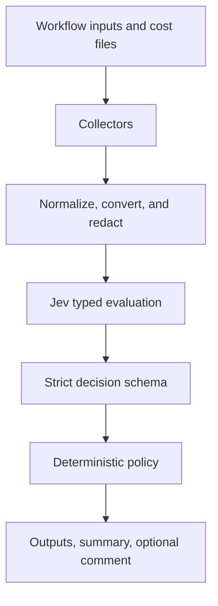

# JEV Cloud Cost Guardian

GitHub Action that compares proposed and current cloud spend with a budget and asks Jev for `approve`, `warn`, `block`, or `manual-review`.

FinOps, platform, and DevOps reviewers use it on pull requests that change Terraform, Kubernetes, or cloud bills. The action shows every cost line. It does not apply infrastructure and it does not hide an unpriced resource.

## How it works



1. Collect normalized estimates, Infracost JSON, a Terraform plan plus pricing catalog, Kubernetes manifests, Kubecost, AWS Cost Explorer, Azure Cost Management, and/or a GCP BigQuery billing export.
2. Convert everything to one monthly budget currency. Missing FX rates fail the run.
3. Ask the configured Jev provider for a typed decision. The gateway path uses `experimental_evaluate` with `typesafe-ai/jev`.
4. Validate the answer. A choice outside the four decisions fails the action.
5. Apply deterministic rails that can tighten `approve` or `warn`, never loosen `block` or `manual-review`, and always put the collected lines back on the result.
6. Write outputs and a job summary. Optionally comment on the pull request. Fail the workflow when the final decision is `block` and `fail_on_block` is true.

Jev chooses the decision. The executor does not calculate `approve` locally when Jev is down, and it does not turn Jev text into a shell command, a file path, or a cloud API call. Allowed effects are outputs, the job summary, a pull request comment, and failing the workflow.

## Quick start

```yaml
permissions:
  contents: read

jobs:
  cost:
    runs-on: ubuntu-latest
    steps:
      - uses: actions/checkout@v4
      - uses: JevForge/jev-cloud-cost-guardian@v1
        env:
          AI_GATEWAY_API_KEY: ${{ secrets.AI_GATEWAY_API_KEY }}
        with:
          budget_monthly: '1000'
          estimates_path: examples/estimates.yml
```

Pin `@v1` or a full commit SHA. See [examples/workflow.yml](examples/workflow.yml) for Infracost and a pull request comment.

`.jev/config.yml` supplies defaults when the matching input is empty. A workflow input wins when it is set. The Jev provider defaults to `vercel-ai-gateway`.

## Inputs

| Input | Required | Default | Role |
| --- | --- | --- | --- |
| `budget_monthly` | yes, unless set in config | | Monthly budget |
| `currency` | no | `USD` | Budget currency |
| `environment` | no | `production` | `production`, `staging`, `development`, `sandbox`, `other` |
| `budget_scope` | no | `projected` | `projected` or `delta` |
| `window_start`, `window_end` | no | current UTC month | End is exclusive |
| `warn_utilization` | no | `0.8` | Evidence label threshold |
| `block_utilization` | no | `1` | Ceiling that tightens `approve` and `warn` to `block` |
| `estimates_path` / `estimates_json` | one source required | | Normalized estimates. Do not pass both |
| `infracost_path` | no | | Infracost JSON |
| `terraform_plan_path` | no | | `terraform show -json` |
| `pricing_catalog_path` | no | | Prices for Terraform addresses |
| `kubernetes_paths` | no | | Manifest files or directories |
| `k8s_unit_prices_path` | with manifests | | CPU and memory unit prices |
| `kubecost_path` | no | | Kubecost allocation JSON |
| `aws_enabled` | no | `false` | AWS Cost Explorer |
| `include_aws_forecast` | no | `false` | Informational forecast line |
| `azure_enabled` | no | `false` | Azure Cost Management |
| `azure_subscription_id` | with Azure | `AZURE_SUBSCRIPTION_ID` | Subscription |
| `gcp_enabled` | no | `false` | BigQuery billing export |
| `gcp_project_id`, `gcp_billing_dataset`, `gcp_billing_table` | with GCP | env vars | Query target |
| `gcp_location` | no | `US` | BigQuery location |
| `normalize_to_monthly` | no | `false` | Scale windows that are not a calendar month |
| `fx_rates` | no | | JSON map such as `{"EUR":1.08}` |
| `min_confidence` | no | `0.75` | Minimum confidence for `approve` |
| `low_confidence_policy` | no | `fail` | `fail`, `warn`, `request-review`, `no-op` |
| `enforce_block_threshold` | no | `true` | Apply the block ceiling |
| `allow_unpriced` | no | `false` | Allow `approve` with unpriced lines |
| `allow_partial` | no | `false` | Allow `approve` with partial lines |
| `allow_missing_baseline` | no | `false` | Allow projected `approve` without a baseline |
| `fail_on_block` | no | `true` | Fail the workflow on `block` |
| `fail_on_manual_review` | no | `false` | Fail the workflow on `manual-review` |
| `redact_resource_names` | no | `true` | Hash resource addresses |
| `jev_provider` | no | `vercel-ai-gateway` | `vercel-ai-gateway`, `typesafe-native`, `custom-compatible` |
| `jev_endpoint` | native and custom | | HTTPS evaluate URL. There is no built-in native host |
| `jev_model` | native and custom | `typesafe-ai/jev` on the gateway | Pinned Jev model id |
| `timeout_ms` | no | `45000` | Jev timeout |
| `connector_timeout_ms` | no | `20000` | Cloud API timeout |
| `comment_on_github` | no | `false` | Create or update one comment |
| `dry_run` | no | `false` | Skip the comment |
| `github_token` | with comments | `github.token` | Token for the comment |

There is no silent fallback between Jev providers. `typesafe-native` needs `TYPESAFE_API_KEY`, `jev_endpoint`, and `jev_model`. `custom-compatible` needs `JEV_CUSTOM_API_KEY`, an HTTPS endpoint, and a model. The gateway needs `AI_GATEWAY_API_KEY`.

## Outputs

| Output | Meaning |
| --- | --- |
| `decision` | `approve`, `warn`, `block`, or `manual-review` |
| `confidence` | 0 to 1 |
| `reason_codes` | JSON array |
| `estimated_monthly_impact` | Proposed monthly delta |
| `baseline_monthly` | Known baseline, or empty |
| `projected_monthly` | Baseline plus delta, or empty |
| `budget_monthly` | Budget used |
| `budget_remaining` | Budget minus scoped cost. Negative is over budget |
| `utilization` | Scoped cost divided by budget |
| `currency` | Budget currency |
| `summary` | One line |
| `explanation` | Short explanation. Never executed |
| `provisional` | `true` when Jev did not return a usable answer |
| `findings` | JSON array of every cost line |
| `sources` | JSON array of source ids |
| `unpriced_count` | Lines without a monthly cost |

## Decision model

Jev answers two typed questions: the decision choice, and whether the estimates are too incomplete to approve. Confidence comes from provider metadata, then from the choice probability. Reason codes are derived from the numbers so they stay inside a fixed enum.

Rails after the Jev answer:

- Incomplete estimates, low confidence, unpriced lines, partial lines, or a missing projected baseline change `approve` to `manual-review`.
- Utilization at or above `block_utilization` changes `approve` and `warn` to `block` when `enforce_block_threshold` is true.
- `block` and `manual-review` are not promoted.
- If Jev is unavailable, the decision is provisional `manual-review` with confidence 0. The low-confidence policy chooses fail, warn, review, or no-op. It never approves.
- Dropped findings are restored and marked `COST_VISIBILITY_ENFORCED`.

Valid and rejected examples are in [docs/decision-contract.md](docs/decision-contract.md).

## Data sent to Jev

The evaluation state includes currency, environment, window, budget, utilization, baseline, delta, projected cost, source ids, warnings, and each cost line's service, resource type, change, monthly cost, and redacted address. Component names are length-limited and secrets are stripped.

The state does not include cloud credentials, Terraform attribute values, private keys, pull request bodies, or raw manifest YAML. Gateway calls set `zeroDataRetention`. Resource addresses are hashed by default before they leave the runner.

## Security and permissions

Use `contents: read`. Add `pull-requests: write` only for comments. `dry_run: true` still evaluates and writes outputs, and it skips the comment. Comments are idempotent: an existing comment that contains `<!-- jev-cloud-cost-guardian -->` is updated.

AWS uses the standard credential chain. Azure uses client credentials. GCP uses `GCP_ACCESS_TOKEN` or a service account file. None of those values are action inputs.

See [SECURITY.md](SECURITY.md) and [docs/connectors.md](docs/connectors.md).

## Troubleshooting

| Symptom | What it means |
| --- | --- |
| `budget_monthly is required` | Set the input or `.jev/config.yml` |
| `No cost sources were configured` | Pass at least one file or enable a billing connector |
| `Missing FX rate` | Add `fx_rates` or align currencies |
| `Billing window is N days` | Use a calendar month or set `normalize_to_monthly` |
| `SCHEMA_REJECTED` | Jev returned a choice outside the contract. The action failed closed |
| `provisional=true` | Jev was not called successfully. The decision is `manual-review`, not `approve` |
| `Path escapes workspace` | Keep estimate paths inside `GITHUB_WORKSPACE` |
| Azure or GCP HTTP errors | The connector failed closed. It does not substitute zero |

## Development

```bash
npm ci
npm test
npm run build
```

Node.js 24. Tests cover parsers, schema rejection, provider normalization, low confidence, unavailable Jev, and the effect allowlist. Coverage thresholds are 80% lines and 75% branches. [CONTRIBUTING.md](CONTRIBUTING.md).

The shared package `@jevforge/core` is not published yet. This action vendors the same provider contract locally: `vercel-ai-gateway`, `typesafe-native`, and `custom-compatible`.

## Marketplace

Listing metadata is in [docs/marketplace.md](docs/marketplace.md). The listing is not published.

## License

[MIT](LICENSE)
